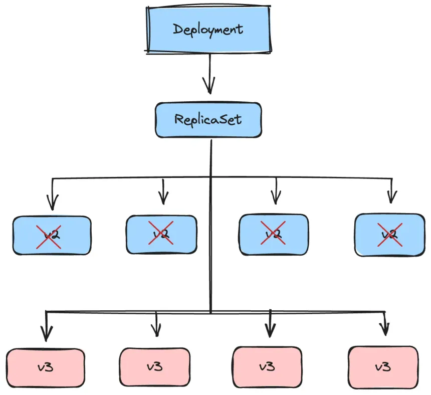
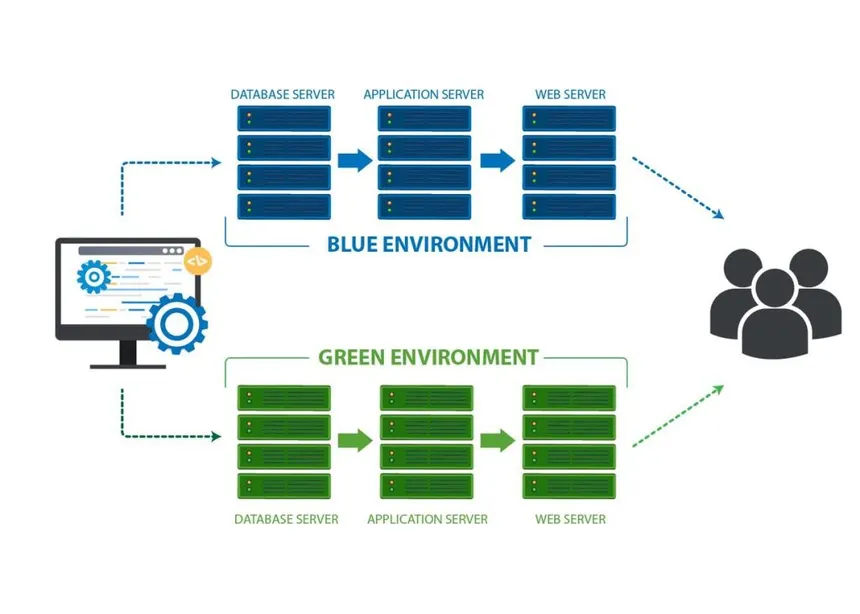
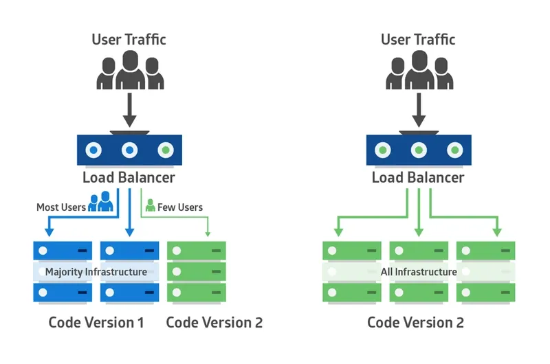

# 🚀 Deployment Strategies Overview

This document provides a comprehensive overview of common deployment strategies used in modern software development.

---

## ❌ Recreate Deployment Strategy (Classic Stop-and-Start)

### What is Recreate Deployment? (Simple Explanation)

Recreate Deployment is the **simplest deployment strategy** where the current version of the application is **stopped completely**, and then the **new version is started**.

- Only **one version** runs at any time
- Users experience **downtime** during deployment
- No parallel environments, no gradual rollout

👉 Think of it as "**turn off the old, turn on the new**".

### How Recreate Deployment Works

1. Take the old version **offline**
2. Stop all instances of the old version
3. Deploy the new version to the servers
4. Start the new version
5. Users access the application once the new version is live

Simple, but there is **service downtime** in between.

### ✅ Pros (Advantages)

- **Simple to Implement**: No complex routing, traffic splitting, or orchestration needed.
- **Low Infrastructure Cost**: Only **one environment** is needed.
- **No Mixed Version Issues**: At any moment, users only see a single version.
- **Easy Rollback Conceptually**: Stop the new version and restart the old version if needed (manual rollback).

### ❌ Cons (Disadvantages)

- **Downtime**: Application is unavailable during deployment.
- **High Risk in Production**: If the new version fails, service is completely down until rollback is done.
- **Not Scalable**: Unsuitable for large-scale or high-availability applications.
- **No Gradual Rollout**: Users cannot be tested on new features gradually.

### 🎯 When is Recreate Deployment a Good Fit?

Recreate Deployment is suitable when:
- Small-scale applications
- Development, staging, or testing environments
- Downtime is acceptable
- Low traffic or non-critical applications
- Simple infrastructure is required

### 🚫 When NOT to Use Recreate Deployment

- High-traffic production systems
- Applications requiring zero downtime
- Critical or revenue-generating systems

### 🧠 Interview One-Liner

> Recreate Deployment is a classic deployment strategy where the old version is completely stopped before the new version starts, causing downtime but keeping the process simple and low-cost.

### 📌 Quick Summary

| Aspect | Description |
|------|------------|
| Rollout Type | Stop-and-start |
| Downtime | High |
| Rollback | Manual |
| Cost | Low |
| Best For | Small-scale or dev/test systems |

---

## 🔄 Rolling Deployment Strategy

### What is Rolling Deployment? (Simple Explanation)

Rolling Deployment is a deployment strategy where the **new version of an application is released gradually by replacing old instances one by one**, instead of deploying everything at once.

At any given time:
- Some users are served by the **old version**
- Some users are served by the **new version**

👉 There is **no separate environment** like Blue-Green; the update happens in-place.

### How Rolling Deployment Works

1. Multiple instances of the application are running
2. One instance is taken out of service
3. The new version is deployed to that instance
4. The updated instance is put back into service
5. Steps 2–4 repeat until all instances run the new version

Users continue accessing the application throughout the process.

### ✅ Pros (Advantages)

- **No Downtime**: The application remains available during deployment.
- **Lower Infrastructure Cost**: No need for duplicate environments.
- **Simple Infrastructure Setup**: Works well with load balancers and container orchestrators.
- **Widely Supported**: Default strategy in platforms like Kubernetes and cloud providers.

### ❌ Cons (Disadvantages)

- **Slow Rollback**: Rolling back requires redeploying the old version instance by instance.
- **Mixed Versions Running**: Users may hit different versions during deployment.
- **Risk of Partial Failure**: A bug can slowly affect more users as rollout continues.
- **Harder Debugging**: Two versions running together can make issue tracking harder.

### 🎯 When is Rolling Deployment a Good Fit?

Rolling Deployment is ideal when:
- Infrastructure cost must be minimal
- Zero downtime is required
- The application is stateless
- Traffic is moderate
- Rollbacks are rare

#### Common Use Cases:
- Backend APIs
- Microservices
- Containerized applications

### 🚫 When NOT to Use Rolling Deployment

- When instant rollback is required
- When users must not see mixed versions
- When schema changes are not backward compatible

### 🧠 Interview One-Liner

> Rolling Deployment is a strategy where application instances are updated gradually, one at a time, ensuring continuous availability without requiring duplicate environments.

### 📌 Quick Summary

| Aspect | Description |
|------|------------|
| Rollout Type | Gradual (instance-by-instance) |
| Downtime | None |
| Rollback | Slow |
| Cost | Low |
| Best For | Cost-sensitive, stateless systems |

---

## 🔵🟢 Blue-Green Deployment Strategy

### What is Blue-Green Deployment? (Simple Explanation)

Blue-Green Deployment is a deployment strategy where **two identical environments** run in parallel:

- **Blue Environment** → Current live version (users are using this)
- **Green Environment** → New version (ready to be released)

#### How it works:
1. Users access the application running in **Blue**
2. New code is deployed to **Green**
3. The Green version is **fully tested** in a production-like setup
4. Traffic is switched from Blue → Green using a load balancer or router
5. If issues occur, traffic can be instantly switched back to Blue

👉 Result: **Zero downtime and instant rollback**

### ✅ Pros (Advantages)

- **Zero Downtime**: Users experience no service interruption during deployment.
- **Instant Rollback**: If the new version fails, traffic can be redirected back to the old version immediately.
- **Safer Releases**: Testing happens in a real production-like environment before release.
- **Simple Deployment Logic**: Easier to understand and implement compared to Canary or Rolling deployments.
- **CI/CD Friendly**: Works extremely well with automated CI/CD pipelines.

### ❌ Cons (Disadvantages)

- **Higher Infrastructure Cost**: Requires two environments running at the same time.
- **Database Migration Challenges**: Schema changes must be backward compatible to allow rollback.
- **Not Ideal for Stateful Applications**: Applications relying on in-memory sessions need extra handling.
- **Traffic Switching Risks**: Incorrect load balancer or DNS configuration can cause issues.

### 🎯 When is Blue-Green Deployment a Good Fit?

Blue-Green deployment is ideal when:
- Zero downtime is critical
- The application is stateless or mostly stateless
- Automated testing is in place
- Fast rollback is required
- Infrastructure cost is manageable

#### Common Use Cases:
- SaaS platforms
- Backend APIs
- Microservices
- Customer-facing web applications

### 🚫 When NOT to Use Blue-Green Deployment

- When infrastructure cost must be minimal
- When database migrations are complex or irreversible
- When the application heavily depends on in-memory state

### 🧠 Interview One-Liner

> Blue-Green Deployment is a strategy where two identical environments run in parallel, and traffic is switched from the old version to the new version after testing, enabling zero-downtime deployments and instant rollback.

### 📌 Quick Summary

| Aspect | Description |
|------|------------|
| Environments | Two (Blue & Green) |
| Downtime | Almost zero |
| Rollback | Instant |
| Cost | Higher |
| Best For | Production-grade applications |

---

## 🐤 Canary Deployment Strategy

### What is Canary Deployment? (Simple Explanation)

Canary Deployment is a deployment strategy where a **new version of an application is released to a small percentage of users first**, while the majority of users continue using the old stable version.

The idea is to **test the new version with real users** before rolling it out to everyone.

👉 The name comes from the "canary in a coal mine" concept — test danger on a small scale first.

### How Canary Deployment Works

1. The current (stable) version is live for most users
2. A new version is deployed alongside the old one
3. A **small percentage of traffic** (e.g., 5–10%) is routed to the new version
4. System metrics are monitored (errors, latency, CPU, memory, logs)
5. If stable, traffic is gradually increased (25% → 50% → 100%)
6. Once fully stable, the old version is removed

### ✅ Pros (Advantages)

- **Reduced Risk**: Only a small group of users is affected if something goes wrong.
- **Real User Validation**: The new version is tested using real production traffic.
- **Gradual Rollout Control**: Traffic can be increased or stopped at any time.
- **Performance Comparison**: Easy to compare metrics between old and new versions.
- **Works Well with Feature Flags**: Canary releases combine well with feature toggles and experimentation.

### ❌ Cons (Disadvantages)

- **More Complex Setup**: Requires traffic splitting, monitoring, and automation.
- **Slower Full Rollout**: Reaching 100% traffic takes more time compared to Blue-Green.
- **Harder Debugging**: Multiple versions running simultaneously can complicate debugging.
- **Rollback Is Not Instant**: Traffic needs to be rebalanced instead of a single switch.
- **Inconsistent User Experience**: Different users may see different behaviors at the same time.

### 🎯 When is Canary Deployment a Good Fit?

Canary Deployment is ideal when:
- Risk must be minimized
- Real-user feedback is important
- The system has strong monitoring and observability
- The application has high traffic
- Frequent releases are required

#### Common Use Cases:
- Large-scale web applications
- Microservices architectures
- Performance-sensitive systems
- Feature experimentation

### 🚫 When NOT to Use Canary Deployment

- Very low-traffic applications
- Systems without proper monitoring
- Applications requiring identical behavior for all users immediately
- Strict compliance or regulatory environments

### 🧠 Interview One-Liner

> Canary Deployment is a strategy where a new version is released to a small subset of users first and gradually rolled out to everyone, reducing risk through real-world validation.

### 📌 Quick Summary

| Aspect | Description |
|------|------------|
| Rollout Type | Gradual |
| Risk | Very Low |
| Rollback | Moderate |
| Complexity | High |
| Best For | High-traffic production systems |
